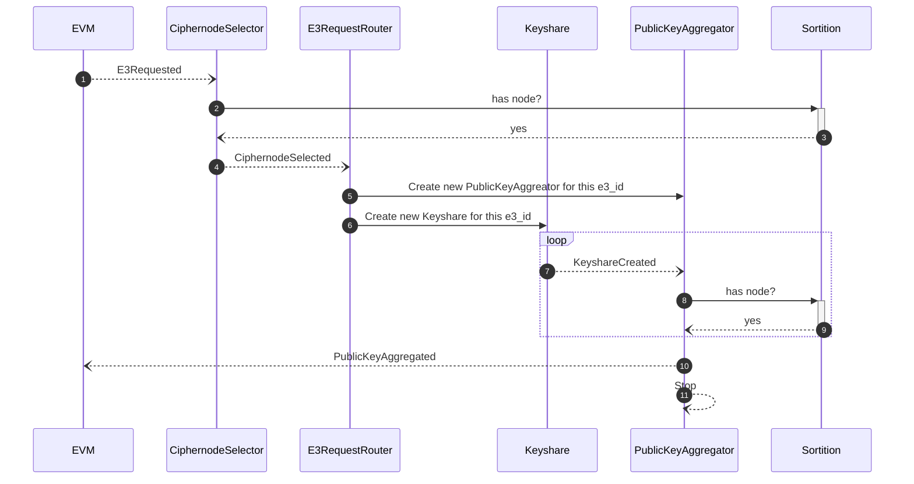
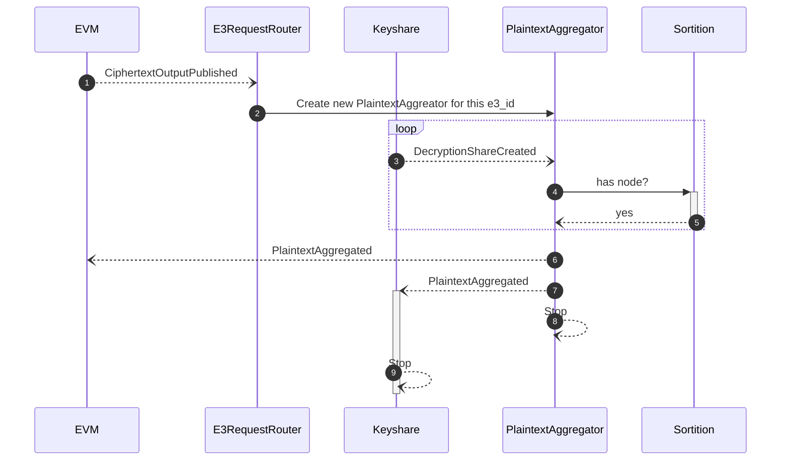
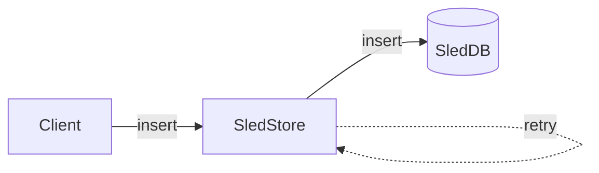
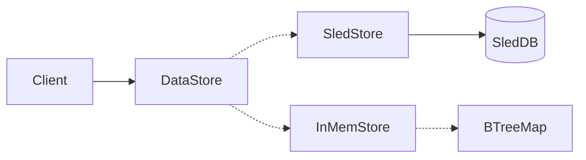
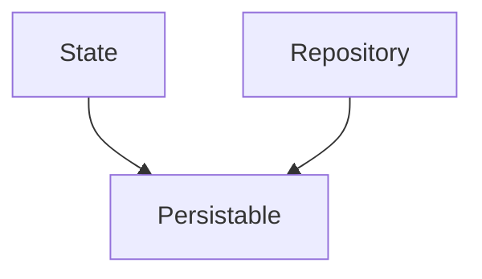

# Prerequisites

Tested prerequisite versions:

```
$ rustc --version
rustc 1.81.0 (eeb90cda1 2024-09-04)
```

We need `solc` available for compiling contract fixtures that are used under test

```
$ solc --version
solc, the solidity compiler commandline interface
Version: 0.8.21+commit.d9974bed.Linux.g++
```

We need foundry's `anvil` to test our evm facing rust code:

```
anvil --version
anvil 0.2.0 (9501589 2024-10-30T00:22:24.181391729Z)
```

Note some older versions of `anvil` are not compatible and can cause errors.

# E3 Requested



# Ciphertext output published



# Debugging

You can debug using the `RUST_LOG` environment var to alter what output is produced by the node


```
RUST_LOG=info enclave start
```

if you supply a tag as an argument you can filter for that tag

```
RUST_LOG="[sortition{id=cn1}]" enclave start --tag cn1
```

This helps filter noise during tests where you might have multiple instances running and you need to see the output of a specific one.

In order to add tracing to a method or function it is recommended to use the `instrument` macro.

```rust
impl Sorition {
    // ...
    #[instrument(name="sortition", skip_all, fields(id = get_tag()))]
    pub async fn attach(
        bus: &Addr<EventBus>,
        store: Repository<SortitionModule>,
    ) -> Result<Addr<Sortition>> {
      // ...
    }
}
```


# On Persistence patterns

_The way persistence is managed within this codebase is 'interesting' here is the story as to how this works and why it has been done like this_ 

Persistence within an Actor Model tends to be based around the idea that actors need to be able to have their state persistable and hydratable upon restart. This enables any actor to be able to just crash on error and restart as required. 

We started persistence by creating an Actor that wraps the database which is good practice within an Actor Model. This has advantages because we can interleave database writes to become a stream of events enabling high throughput. We can create delivery guarantees by storing events in a persistent queue at a later point if need be.



## DataStore

Next we needed a way to polymorphically pick between a real database and an in memory database for testing - to do this we utilize Actix's `Recipient<Message>` trait which means we can accept any actor that is happy to receive an `Insert` or a `Get` message. This means we can create a Key Value Store struct and pass in either a `SledStore` or an `InMemStore` Actor to the `DataStore` actor to accomplish this.

```rust
let store = DataStore::from(SledStore::from(SledDb::new()));
```

or for testing:

```rust
let store = DataStore::from(InMemStore::new());
```



The `DataStore` actor also has some convenience methods within it where it is possible to scope the keys so that you can consider the information you are storing as more of a tree structure as opposed to a flat list.

```rust
let store = DataStore::from(&addr);
store.base("//foo")
  .scope("bar")
  .scope("/baz")
  .get_scope()?, // "//foo/bar/baz"
```


## Repository

There was an attempt to use this throughout the app but it became apparent this was causing the knowledge of where data was saved to be spread throughout the codebase. What we needed was for the components not to really care how their data was saved but for us to be able to easily have a sense of the different keys under which data was being saved in a centralized place. 

It also made sense to create a `Repository<T>` interface to encapsulate saving of data from within an actor or routine in theory the repository could use whatever data store it requires to save the data. This could even be a SQL DB or the filesystem if required.

We also created a `Repositories` struct to provide a central point for the repositories however this was leading to cargo dependency issues as this was a struct that dependend on every package for it's types but was also depended on by every package which made placing it somewhere within our dependency heirarchy challenging. This clearly was an issue.


## Snapshotting

We had a way to save bytes data with the `DataStore` and had a way to specify where that could be saved but actors need to be restartable and be able to be hydrated and we needed a standard way to accomplish this. To do this in typical Rust fashion we creaed a set of traits: 

- [`Snapshot`](https://github.com/gnosisguild/enclave/blob/main/packages/ciphernode/data/src/snapshot.rs) for defining how an object can create a snapshot of it's state
- [`Checkpoint`](https://github.com/gnosisguild/enclave/blob/main/packages/ciphernode/data/src/snapshot.rs) for defining how to save that snapshot to a repository
- [`FromSnapshot`](https://github.com/gnosisguild/enclave/blob/main/packages/ciphernode/data/src/snapshot.rs) and [`FromSnapshotWithParams`](https://github.com/gnosisguild/enclave/blob/main/packages/ciphernode/data/src/snapshot.rs) for defining how an object could be reconstituted from a snapshot

This worked well especially for objects who's persistable state needs to be derived from a subset of the saved state however there are a couple of problems:

- `self.checkpoint()` needs to be called everytime you want to save the state
- Using these traits is very verbose and repeditive - especially for situations where the state was just a field on the actor which it often is.
- These traits mean you need to mix some persistence API within your business logic API unless you create a separate struct just for persistence.

## Enter Persistable

Persistable is a struct that connects a repository and some in memory state and ensures that every time the in memory state is mutated that the state is saved to the repository.



Aside from being less verbose it means we now have a centralized point at which we can implement batching should we need in the future and it means we should have less touch points for persistence in future. 

