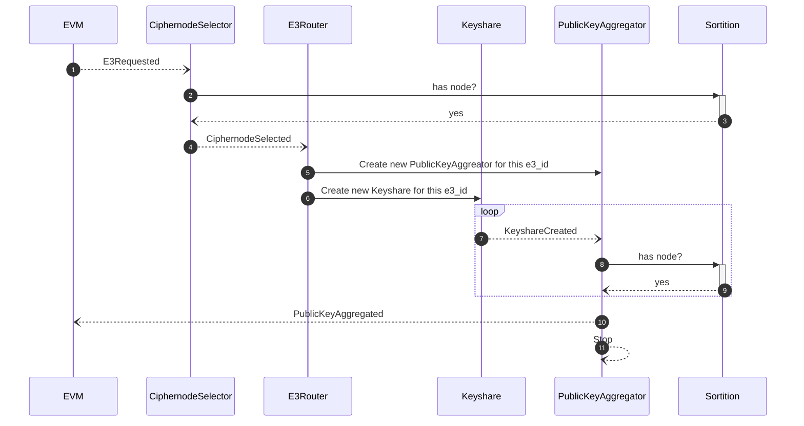
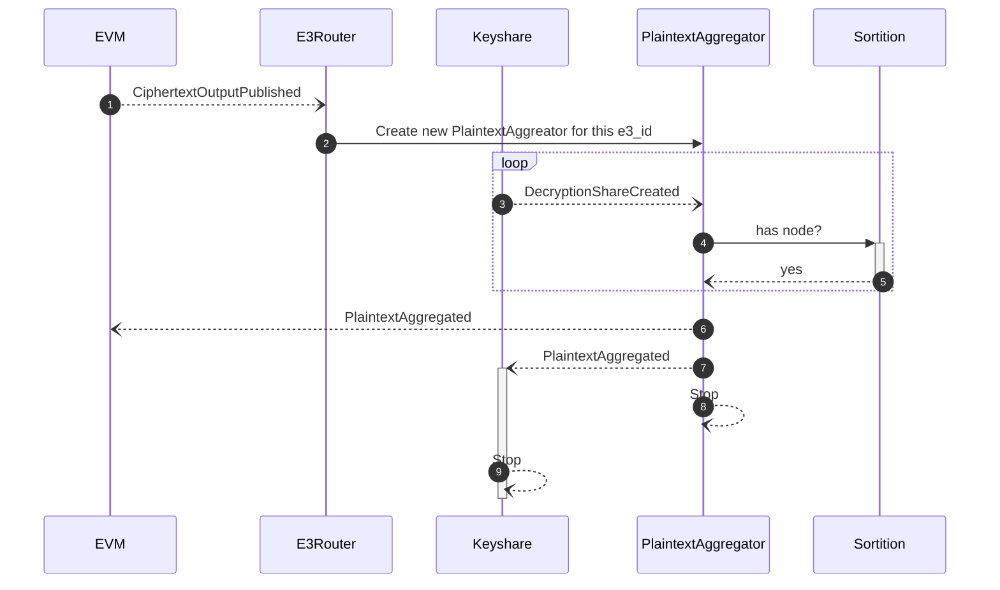

# Prerequisites

Tested prerequisite versions:

```
$ rustc --version
rustc 1.81.0 (eeb90cda1 2024-09-04)
```

We need `solc` available for compiling contract fixtures that are used under test

```
$ solc --version
solc, the solidity compiler commandline interface
Version: 0.8.21+commit.d9974bed.Linux.g++
```

We need foundry's `anvil` to test our evm facing rust code:

```
anvil --version
anvil 0.2.0 (9501589 2024-10-30T00:22:24.181391729Z)
```

Note some older versions of `anvil` are not compatible and can cause errors - by older I mean before this particuar dated patch `(9501589 2024-10-30T00:22:24.181391729Z)` - note they are not using semver.

If you get an error that looks similar to the following you likely need to upgrade your anvil version:

```
ERROR! event=EnclaveError(EnclaveError { err_type: Evm, message: "deserialization error: duplicate field `status` at line 1 column 34542" })
```

# E3 Requested



# Ciphertext output published



# Debugging

You can debug using the `-vvv` cli arguments to alter what output is produced by the node

```
# Show INFO logging
enclave start
```

```
# Show DEBUG logging
enclave start -v
```

```
# Show TRACE logging
enclave start -vv
```

if you want to remove all output aside from errors you can use the `--quiet` argument.

```
enclave --quiet
```

## Open telemetry

The node can be run with open telemetry by passing in the `--otel` arg.

We can run a Jaeger instance using docker:

```
docker run -e COLLECTOR_OTLP_ENABLED=true -p 16686:16686 -p 4317:4317 -p 4318:4318 jaegertracing/jaeger:latest
```

```
enclave start -v --otel http://localhost:4317
```

Now you can visit your Jaeger instance at http://localhost:16686 to view the logs from your node.

### Jaeger with tests

To view logs locally from your tests set the `OTEL` env var when calling your tests:

```
OTEL="http://localhost:4317" yarn test:integration base
```

Then head to http://localhost:16686 to see the results
