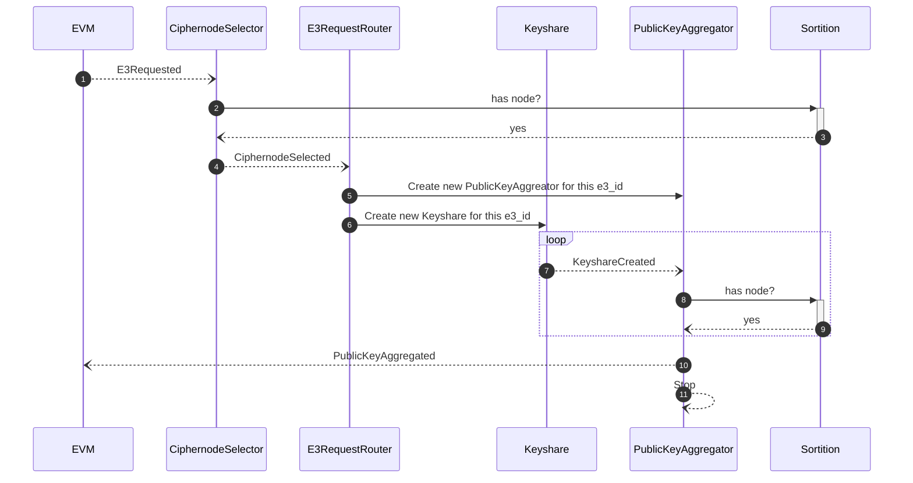
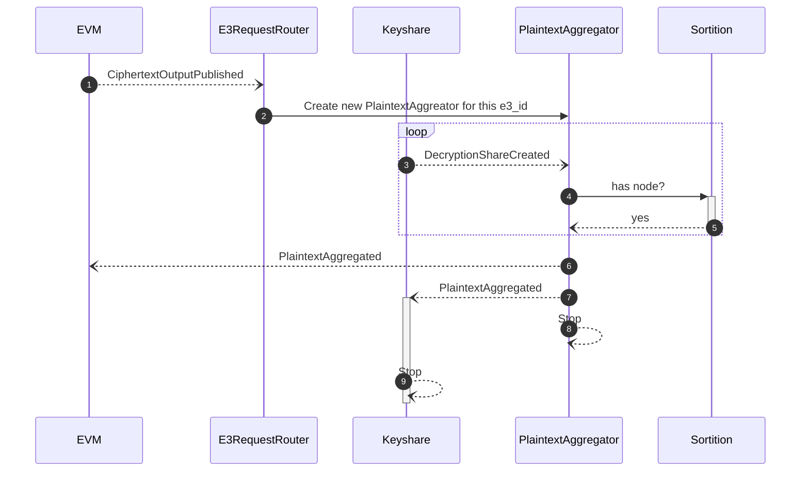

# Prerequisites

Tested prerequisite versions:

```
$ rustc --version
rustc 1.81.0 (eeb90cda1 2024-09-04)
```

We need `solc` available for compiling contract fixtures that are used under test

```
$ solc --version
solc, the solidity compiler commandline interface
Version: 0.8.21+commit.d9974bed.Linux.g++
```

We need foundry's `anvil` to test our evm facing rust code:

```
anvil --version
anvil 0.2.0 (9501589 2024-10-30T00:22:24.181391729Z)
```

Note some older versions of `anvil` are not compatible and can cause errors - by older I mean before this particuar dated patch `(9501589 2024-10-30T00:22:24.181391729Z)` - note they are not using semver.

If you get an error that looks similar to the following you likely need to upgrade your anvil version:

```
ERROR! event=EnclaveError(EnclaveError { err_type: Evm, message: "deserialization error: duplicate field `status` at line 1 column 34542" })
```

# E3 Requested



# Ciphertext output published



# Debugging

You can debug using the `RUST_LOG` environment var to alter what output is produced by the node


```
RUST_LOG=info enclave start
```

if you supply a tag as an argument you can filter for that tag

```
RUST_LOG="[sortition{id=cn1}]" enclave start --tag cn1
```

This helps filter noise during tests where you might have multiple instances running and you need to see the output of a specific one.

In order to add tracing to a method or function it is recommended to use the `instrument` macro.

```rust
impl Sorition {
    // ...
    #[instrument(name="sortition", skip_all, fields(id = get_tag()))]
    pub async fn attach(
        bus: &Addr<EventBus>,
        store: Repository<SortitionModule>,
    ) -> Result<Addr<Sortition>> {
      // ...
    }
}
```

