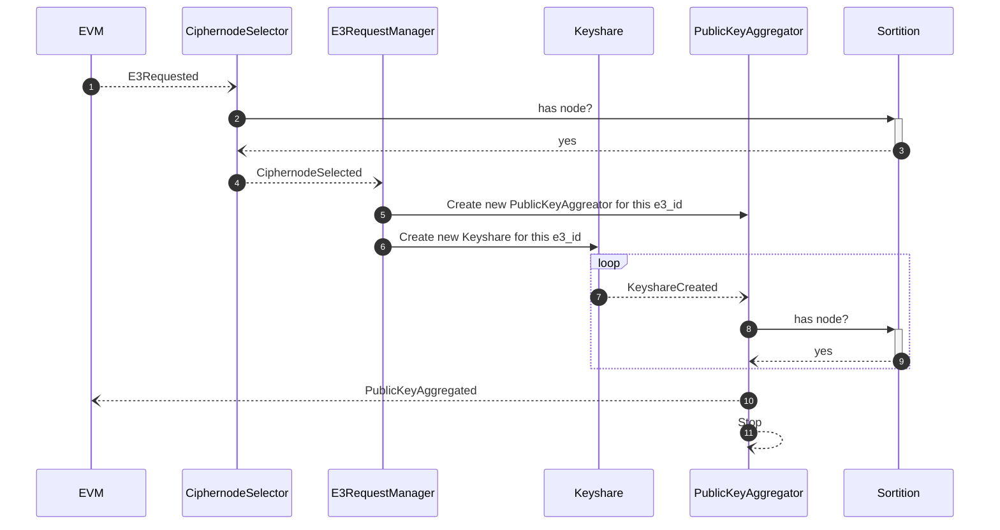
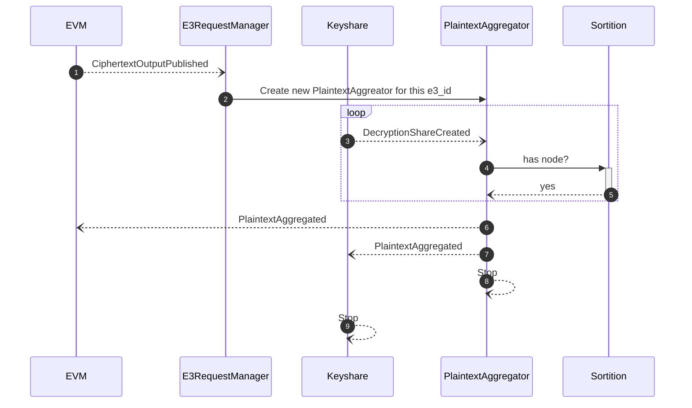

# E3 Requested

```mermaid
sequenceDiagram
    autonumber
    participant EVM as EVM
    participant CS as CiphernodeSelector
    participant E3 as E3RequestManager
    participant KS as Keyshare
    participant PKA as PublicKeyAggregator
    participant S as Sortition
    
    EVM--)CS: E3Requested 
    CS->>+S: has node?
    S--)-CS: yes
    CS--)E3: CiphernodeSelected
    E3->>PKA: Create new PublicKeyAggreator for this e3_id
    E3->>KS: Create new Keyshare for this e3_id
    loop
        KS--)PKA: KeyshareCreated
        PKA->>+S: has node?
        S--)-PKA: yes
    end
    PKA--)EVM: PublicKeyAggregated
    PKA--)PKA: Stop
```

# Ciphertext output published

```mermaid
sequenceDiagram
    autonumber
    participant EVM as EVM
    participant E3 as E3RequestManager
    participant KS as Keyshare
    participant PTA as PlaintextAggregator
    participant S as Sortition
    
    EVM--)E3: CiphertextOutputPublished
    E3->>PTA: Create new PlaintextAggreator for this e3_id
    loop
        KS--)PTA: DecryptionShareCreated
        PTA->>+S: has node?
        S--)-PTA: yes
    end
    PTA--)EVM: PlaintextAggregated
    PTA--)KS: PlaintextAggregated
    PTA--)PTA: Stop
    KS--)KS: Stop
```

