# Core

Here we are creating an actor system for managing concurrency and complexity.

- [x] Setup EventBus actor for managing events locally
- [x] Setup Ciphernode actor for managing interacting with data services
- [x] Isolate FHE computation to a Fhe actor in order to manage fhe calculations
- [x] Aggregate key to create the CommitteeKey in a simple way by simply dropping duplicates
- [x] Event's ID is the hash of the payload
- [x] Collections in events are strictly ordered
- [ ] Create P2P Actor to listen to the event bus and forward events and manage libp2p gossipsub connection
- [ ] Setup a binary with a run loop to run libp2p
- [ ] Create commands to artificially dispatch a ComputationRequested event
- [ ] Encrypt secret key when storing locally
- [ ] Setup AesEncryptor actor for encrypting local data and managing keys
- [ ] Connect data service to sled db

## Architecture 

The rough architecture currently is like this:

```mermaid
flowchart TD
    EB[EventBus]
    C[Ciphernode] -.-> EB
    C --> Fhe
    C --> Data
    Data --> DS[(" ")]
    Fhe
    Evm["Evm"] -.-> Eth(("fa:fa-ethereum"))
    P[P2p] -.- libp2p(("🌐"))
    A1[[CommitteeKey]]
    A0[Committee]
    A0 --> Evm
    A0 --> A1
    A0 -.-> EB
    A1 -.-> EB
    A1 --> Fhe
    EB --> P

```

