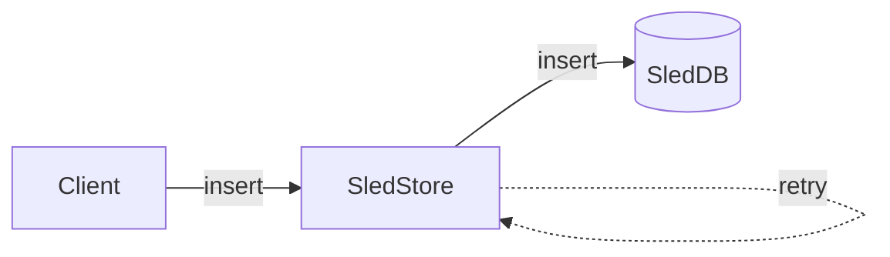
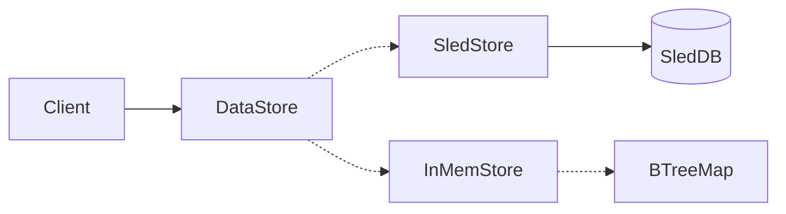
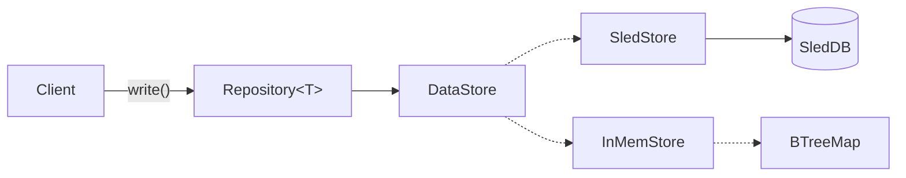

# On Persistence patterns

_The way persistence is managed within this codebase has a few elements to it. So here is the story as to how this works and why it has been done like this_

Persistence within an Actor Model tends to be based around the idea that actors need to be able to have their state persistable and hydratable upon restart. This enables in an ideal scenario any actor to be able to just crash on error and restart as required.

We started persistence by creating an Actor that wraps the database which is good practice within an Actor Model. This has advantages because we can interleave database writes to become a stream of events enabling high throughput. We can create delivery guarantees by storing events in a persistent queue at a later point if need be.



## DataStore

Next we needed a way to polymorphically pick between a real database and an in memory database for testing - to do this we utilize Actix's `Recipient<Message>` trait which means we can accept any actor that is happy to receive an `Insert` or a `Get` message. This means we can create a Key Value Store struct and pass in either a `SledStore` or an `InMemStore` Actor to the `DataStore` actor to accomplish this.

```rust
let store = DataStore::from(SledStore::from(SledDb::new()));
```

or for testing:

```rust
let store = DataStore::from(InMemStore::new());
```



The `DataStore` actor also has some convenience methods within it where it is possible to scope the keys so that you can consider the information you are storing as more of a tree structure as opposed to a flat list.

```rust
let store = DataStore::from(&addr);
let scoped = store.scope("//foo/bar/baz");
scoped.write(some_data);
```

## Repository

There was an attempt to use the `DataStore` throughout the app but it became apparent this was causing the knowledge of where and how the data was saved to be spread throughout the codebase. What we needed was for the components not to really care how their data was saved but for us to be able to easily have a sense of the different keys under which data was being saved in a centralized place.

Also `DataStore` can take any type of serializable data to save at a key location but this means the data in the DataStore was effectively untyped.

To solve this it made sense to create a typed `Repository<T>` interface to encapsulate saving of data from within an actor or routine and in theory the repository could use whatever underlying mechanism requires to save the data. This could even be a SQL DB or the filesystem if required. Whatever it's type T the Repository knows how to save it.

The tradeoff is we get a slightly deeper stack but each layer adds a responsibility to the data saving stack:




| Layer               | Functionality                                                                                                                   |
| ------------------- | ------------------------------------------------------------------------------------------------------------------------------- |
| `Repository<T>`     | Strongly typed Data persistence for a single item. Configured to know how to save its data.                                     |
| `DataStore`         | Flexible KV store. Client can scope to specific namespace. Can be backed by polymorphic data actor to handle testing scenarios. |
| `{InMem,Sled}Store` | Actor to receive `Insert` and `Get` requests can only save raw bytes.                                                           |

## Snapshotting

We had a way to save bytes data with the `DataStore` and had a way to specify where that could be saved but actors need to be restartable and be able to be hydrated and we needed a standard way to accomplish this. To do this in typical Rust fashion we created a set of traits:

- [`Snapshot`](https://github.com/gnosisguild/enclave/blob/main/packages/ciphernode/data/src/snapshot.rs) for defining how an object can create a snapshot of it's state
- [`Checkpoint`](https://github.com/gnosisguild/enclave/blob/main/packages/ciphernode/data/src/snapshot.rs) for defining how to save that snapshot to a repository
- [`FromSnapshot`](https://github.com/gnosisguild/enclave/blob/main/packages/ciphernode/data/src/snapshot.rs) and [`FromSnapshotWithParams`](https://github.com/gnosisguild/enclave/blob/main/packages/ciphernode/data/src/snapshot.rs) for defining how an object could be reconstituted from a snapshot

This worked well especially for objects who's persistable state needs to be derived from a subset of the saved state however there are a couple of problems:

- `self.checkpoint()` needs to be called everytime you want to save the state
- Using these traits is very verbose and repeditive - especially for situations where the state was just a field on the actor which it often is.
- These traits mean you need to mix some persistence API within your business logic API unless you create a separate struct just for persistence.

## Enter Persistable

Persistable is a struct that connects a repository and some in memory state and ensures that every time the in memory state is mutated that the state is saved to the repository.

This has several benefits:

- Less verbose
- Centralized batching point for logical operations
- Can remove complex "snapshot" traits
- Simpler initialization
- No need to consider the underlying data saving mechanism - logic can be [persistence ignorant](https://www.linkedin.com/pulse/persistence-ignorance-domain-driven-design-ilkay-polat-atmae).

```rust

// Some how we get a repository for a type
let repo:Repository<Vec<String>> = get_repo();

// We can use the load to create a persistable object from the contents of the persistance layer that the repository encapsulates
let persistable:Persistable<Vec<String>> = repo.load().await?;

// If we add a name to the list the list is automatically synced to the database
persistable.try_mutate(|mut list| {
  list.push("Fred");
  Ok(list)
})?;

// We can set new state
persistable.set(vec![String::from("Hello")]);

// We can try and get the data if it is set on the object
if persistable.try_get()?.len() > 0 {
    println!("Repo has names!")
}

// We an clear the object which will clear the repo
persistable.clear();

assert_eq!(persistable.get(), None);
```

To use it we can just have it as a field on a struct or actor:

```rust
struct MyActor {
  state: Persistable<Vec<String>>
}
```

We have also extracted the key calculation mechanism to a [`StoreKeys`](https://github.com/gnosisguild/enclave/blob/main/packages/ciphernode/config/src/store_keys.rs) struct. This is used in various places when creating repsitory factories for example [here](https://github.com/gnosisguild/enclave/blob/main/packages/ciphernode/aggregator/src/repositories.rs)
