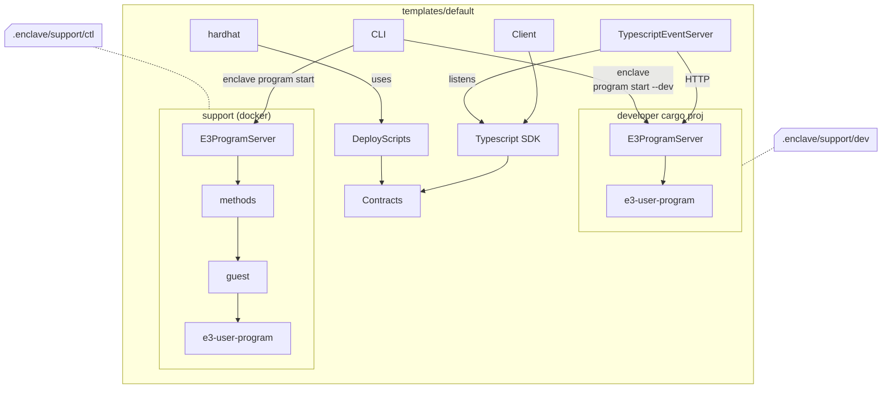

```mermaid
flowchart TD
 subgraph subGraph0["developer cargo proj"]
        P["e3-user-program"]
        PS["E3ProgramServer"]
  end
 subgraph subGraph1["support (docker)"]
        PSS["E3ProgramServer"]
        R0["methods"]
        G["guest"]
        P2["e3-user-program"]
  end
 subgraph s1["templates/default"]
        CL["Client"]
        SDK["Typescript SDK"]
        TSS["TypescriptEventServer"]
        CLI["CLI"]
        C["Contracts"]
        D["DeployScripts"]
        HH["hardhat"]
        subGraph0
        subGraph1
  end
    PSS --> R0
    R0 --> G
    G --> P2
    CL --> SDK
    SDK --> C
    HH --uses--> D
    D --> C
    TSS -- HTTP --> PS
    TSS -- listens --> SDK
    CLI -- enclave program start --> PSS
    CLI -- "enclave <br/>program start --dev" --> PS
    PS --> P
    n1[".enclave/support/ctl"] -.- subGraph1
    n2[".enclave/support/dev"] -.- subGraph0

    n1@{ shape: card}
    n2@{ shape: card}
     PS:::internal-link
     PSS:::internal-link
     SDK:::internal-link
     CLI:::internal-link
     C:::internal-link

    click PS "https://github.com/gnosisguild/enclave/tree/main/crates/program-server/E3ProgramServer.md"
    click PSS "https://github.com/gnosisguild/enclave/tree/main/crates/program-server/E3ProgramServer.md"
    click SDK "https://github.com/gnosisguild/enclave/tree/main/packages/enclave-sdk/Typescript SDK.md"
    click CLI "https://github.com/gnosisguild/enclave/tree/main/crates/cli/CLI.md"
    click C "https://github.com/gnosisguild/enclave/tree/main/packages/evm/docs/Contracts.md"
```

Links

[[CLI]]
[[Contracts]]
[[E3ProgramServer]]
[[E3ProgramServer]]
[[Typescript SDK]]

