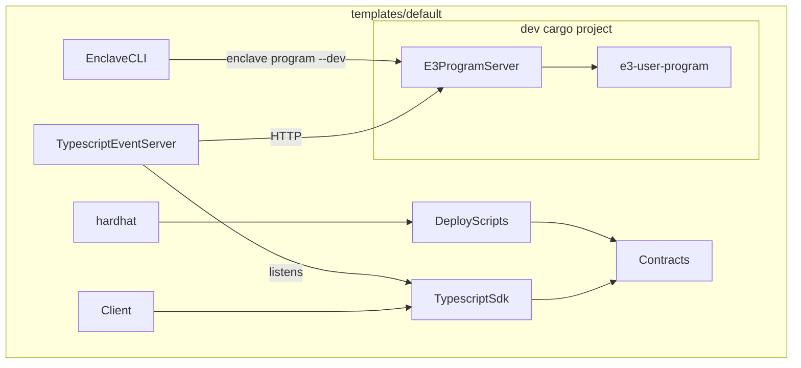

```mermaid
flowchart TD
    subgraph s1["templates/default"]
        CL["Client"]
        SDK["TypescriptSdk"]
        TSS["TypescriptEventServer"]
        CLI["EnclaveCLI"]
        C["Contracts"]
        D["DeployScripts"]
        HH["hardhat"]

        subgraph "dev cargo project"
        P["e3-user-program"]
		PS["E3ProgramServer"]
        end
        
        CL --> SDK
        SDK --> C
        HH --> D
        D --> C
        TSS --HTTP--> PS
        TSS --listens--> SDK
        CLI --"enclave program --dev"--> PS
        PS --> P
    end
```
